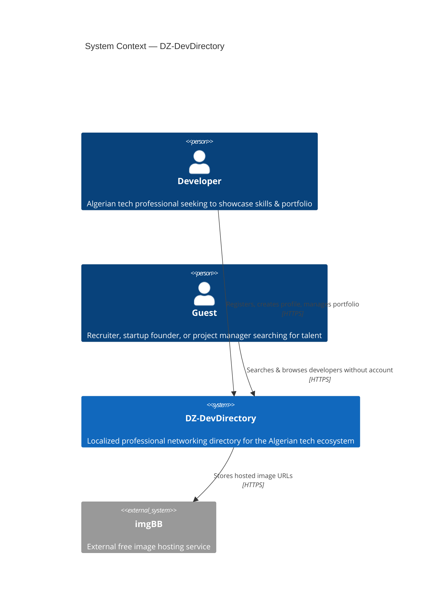
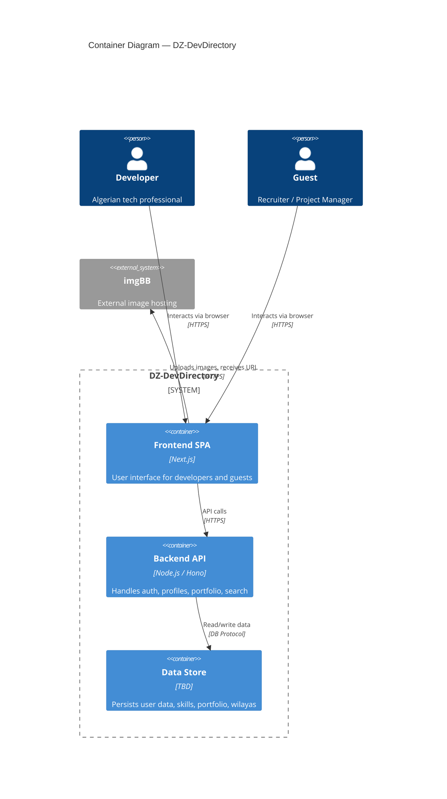
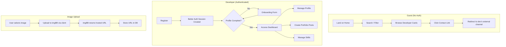

# Architecture Overview

> [!NOTE] This document describes the high-level system architecture of DZ-DevDirectory. Database schema details and API routes are documented separately.

---

## System Context (C4 Level 1)

---

## Container Diagram (C4 Level 2)

---

## Tech Stack Decision Matrix

| Layer            | Technology       | Rationale                                                                 |
|------------------|------------------|---------------------------------------------------------------------------|
| Frontend         | Next.js          | SSR/SSG, App Router, React ecosystem, TypeScript-first                    |
| Styling          | Tailwind CSS     | Utility-first, rapid UI development, small bundle                         |
| Backend          | Node.js / Hono   | Lightweight, fast, TypeScript-native, edge-ready                          |
| Auth             | Better Auth      | Built-in session management, CSRF, rate limiting, password hashing        |
| Database Adapter | TBD              | Will be decided later — Better Auth supports Drizzle, Prisma, Kysely, etc.|
| Image Hosting    | imgBB            | Free, no server-side binary storage, only URLs persisted                  |
| Language         | TypeScript       | End-to-end type safety across frontend and backend                        |

---

## High-Level Data Flow

---

> [!IMPORTANT] The app has zero internal messaging, payment, or notification systems. All professional contact flows through the developer's verified external channels (GitHub, LinkedIn, Email, Portfolio).
