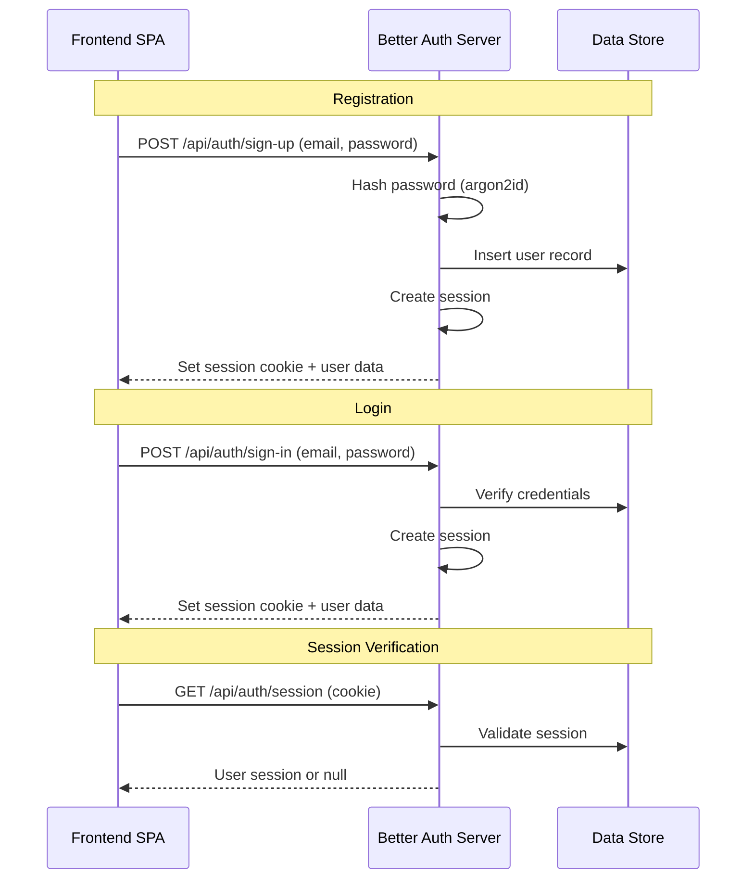
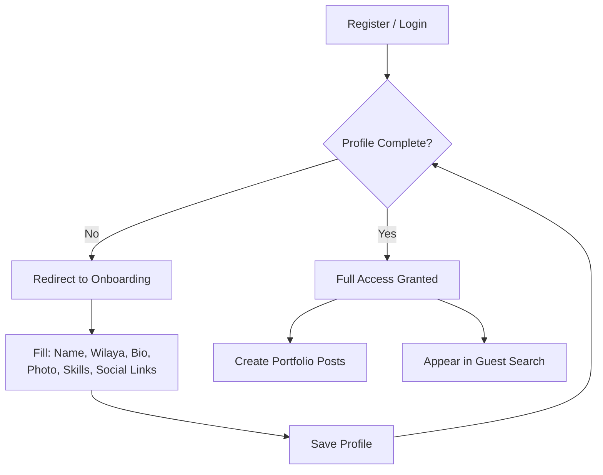

# Authentication & Security

> [!IMPORTANT] This project uses **Better Auth** as its authentication framework. All auth flows, session management, and security guardrails are built on Better Auth's primitives.

---

## Better Auth Integration

| Module               | Status     | Notes                                      |
|----------------------|------------|--------------------------------------------|
| Email / Password     | ✅ Enabled | Local credential auth, no email verification|
| Session Management   | ✅ Enabled | Database sessions (default)                |
| CSRF Protection      | ✅ Built-in | Automatic with cookie-based sessions      |
| Rate Limiting        | ✅ Built-in | Configurable per endpoint                  |
| Password Hashing     | ✅ Built-in | Argon2id / bcrypt (configurable)           |
| Email Verification   | ❌ Disabled | No email service configured                |
| Password Reset       | ❌ Disabled | No email service configured                |
| OAuth / Social       | ❌ Disabled | Not in scope                              |

---

## Auth Flow — Registration & Login

---

## Onboarding Gate Logic

New users must complete their profile before publishing any portfolio content or appearing in search results.

**Required onboarding fields:**

| Field         | Type     | Validation                       |
|---------------|----------|----------------------------------|
| Full Name     | string   | 2-100 chars                      |
| Wilaya        | enum     | Must be one of 58 Algerian Wilayas |
| Bio           | text     | Max 500 chars                    |
| Avatar URL    | string   | Optional, valid URL              |
| GitHub URL    | string   | Optional, valid URL              |
| LinkedIn URL  | string   | Optional, valid URL              |
| Portfolio URL | string   | Optional, valid URL              |
| Business Email| string   | Optional, valid email format     |
| Skills        | string[] | Min 1, selected from skill tags  |

---

## Session Strategy

| Property          | Configuration                                      |
|-------------------|----------------------------------------------------|
| Session Store     | Database sessions (Better Auth default)            |
| Session Expiry    | 7 days (configurable)                              |
| Session Cookie    | `httpOnly`, `secure` (prod), `sameSite: "lax"`     |
| Session Rotation  | On sign-in (old session invalidated)               |
| Multi-Device      | Multiple concurrent sessions allowed               |

---

## Security Guardrails

| Guardrail            | Implementation Layer       | Details                                        |
|----------------------|----------------------------|------------------------------------------------|
| Password Hashing     | Better Auth                | Argon2id with configurable cost factors        |
| CSRF Protection      | Better Auth                | Automatic via cookie-based sessions            |
| Rate Limiting        | Better Auth                | Per-endpoint: sign-in (5/min), sign-up (3/min) |
| Input Sanitization   | Backend Middleware         | Strip/escape all user-provided strings         |
| Session Hijacking    | Better Auth                | `httpOnly` cookies, session rotation           |
| Profile Gate         | Backend Middleware         | Block publish/search visibility if incomplete  |

---

> [!WARNING] No email service is configured. The following features are unavailable:
> - Email verification during registration
> - Password reset flow
> - Account recovery
> - Email notifications
>
> Consider adding an email provider later to enable these flows.
