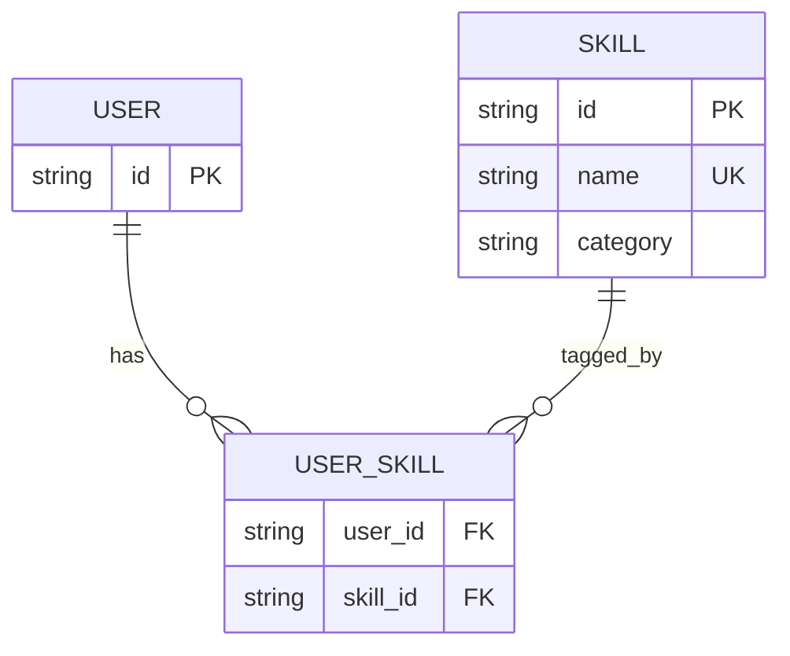
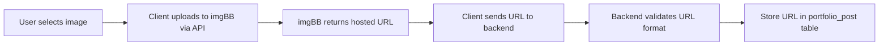

# Feature Specification

---

## Feature Matrix

| # | Feature                    | Actor       | Priority | Description                                      |
|---|----------------------------|-------------|----------|--------------------------------------------------|
| 1 | Authentication             | Developer   | P0       | Email/password auth via Better Auth              |
| 2 | Onboarding Gate            | Developer   | P0       | Block publishing until profile is complete       |
| 3 | Profile Management         | Developer   | P0       | Manage personal info, wilaya, bio, social links  |
| 4 | Skill Matrix               | Developer   | P0       | Many-to-many tagging system for tech capabilities|
| 5 | Portfolio Posts            | Developer   | P0       | Create project posts with descriptions + images  |
| 6 | Guest Discovery            | Guest       | P0       | Search & browse developers without auth          |
| 7 | Multi-Criteria Search      | Guest       | P0       | Filter by name, wilaya, and multiple skill tags  |
| 8 | External Contact           | Guest       | P0       | Click-to-contact via dev's verified channels     |

---

## Feature 1: Authentication

| Property          | Detail                                       |
|-------------------|----------------------------------------------|
| Framework         | Better Auth (email/password module)          |
| Password Hashing  | Argon2id (handled by Better Auth)            |
| Session Storage   | Database sessions                            |
| Rate Limiting     | 5 attempts/min for sign-in                   |

See [[Authentication & Security]] for full details.

---

## Feature 2: Onboarding Gate

| Property          | Detail                                       |
|-------------------|----------------------------------------------|
| Trigger           | After registration, before any publish       |
| Check             | Middleware verifies profile completeness     |
| Blocked Actions   | Create portfolio posts, appear in search     |
| Allowed Actions   | View/edit own profile, browse other devs     |

**Required fields** — see [[Authentication & Security#Required onboarding fields]]

---

## Feature 3: Profile Management

| Field          | Type      | Required | Validation                      |
|----------------|-----------|----------|---------------------------------|
| Full Name      | string    | ✅ Yes   | 2-100 chars                    |
| Wilaya         | enum      | ✅ Yes   | One of 58                       |
| Bio            | text      | ✅ Yes   | Max 500 chars                  |
| Avatar URL     | string    | ❌ No    | Valid URL format                |
| GitHub URL     | string    | ❌ No    | Valid URL format                |
| LinkedIn URL   | string    | ❌ No    | Valid URL format                |
| Portfolio URL  | string    | ❌ No    | Valid URL format                |
| Business Email | string    | ❌ No    | Valid email format              |
| Skills         | string[]  | ✅ Yes   | Min 1, max 20                   |

---

## Feature 4: Skill Matrix

| Property           | Detail                                             |
|--------------------|----------------------------------------------------|
| Relation Type      | Many-to-Many (junction table: user_skills)         |
| Skill Source       | Predefined tag list + optional custom creation     |
| Max Per User       | 20 skills                                          |
| Display            | Rendered as tags/chips on profile card             |
| Search Relevance   | Skills act as primary filter in guest search       |

---

## Feature 5: Portfolio Posts

| Property        | Detail                                           |
|-----------------|--------------------------------------------------|
| Content Type    | Text description + optional images (no PDFs)     |
| Image Source    | imgBB hosted URLs only                           |
| File Restriction| PDF, DOC, DOCX, ZIP — blocked at client + server |
| Created At      | Locked to server timestamp at creation (millisecond precision) |
| Edited At       | Updated on modification; created_at is immutable |
| Max Images      | 5 per post                                       |
| Max Description | 2000 chars                                       |

**Image upload flow:**

> [!WARNING] No binary image files are ever stored on the server. Only imgBB URLs are persisted in the database. This keeps the app assetless and avoids storage/compliance overhead.

---

## Feature 6: Guest Discovery

| Property       | Detail                                            |
|----------------|---------------------------------------------------|
| Auth Required  | No — fully open access                            |
| Visibility     | Only developers with complete profiles appear     |
| Contact Method | Click developer's external link (GitHub, LinkedIn, etc.) |
| Rate Limit     | Search: 30 requests/min per IP                    |

See [[Search & Discovery]] for full details.

---

## Feature 7: Multi-Criteria Search

| Property        | Detail                                            |
|-----------------|---------------------------------------------------|
| Filters         | Name (text), Wilaya (enum), Skills (multi-select) |
| Concurrency     | Filters applied simultaneously via combined query |
| Debounce        | Client-side: 400ms debounce before API call       |
| Pagination      | Cursor-based, 20 results per page                 |

See [[Search & Discovery]] for architecture and query pipeline.

---

## Feature 8: External Contact

| Property       | Detail                                            |
|----------------|---------------------------------------------------|
| Internal Chat  | ❌ Not implemented                                |
| Contact Method | Click-to-open developer's external link           |
| Channels       | GitHub, LinkedIn, Portfolio URL, Business Email   |
| Tracking       | Optional click count (future enhancement)         |

> [!NOTE] All professional contact occurs through the developer's verified external channels. The app deliberately avoids internal messaging to maintain simplicity and avoid regulatory complexity.
