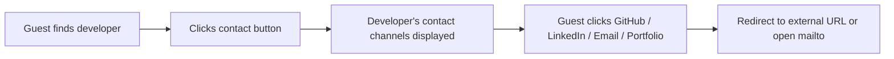

# Search & Discovery

> [!IMPORTANT] The search system is the core value proposition for Guests (recruiters, startups, project managers). It must be fast, accurate, and put minimal strain on the database.

---

## Multi-Criteria Matching Engine

Guests can filter developers using three filter dimensions **simultaneously**:

| Filter     | Type         | Behavior                                     |
|------------|--------------|----------------------------------------------|
| Name       | Full-text    | Partial match on developer full name         |
| Wilaya     | Exact match  | Single-select dropdown (1 of 58 Wilayas)     |
| Skills     | Multi-select | Any-selected match (OR logic across tags)    |

**Search query logic:** All active filters are combined with **AND** — results must satisfy every active filter simultaneously.

---

## Query Pipeline

```mermaid
flowchart TD
  A[Guest types / selects filters] --> B[Client-side debounce 400ms]
  B --> C{New value === last value?}
  C -->|Yes| D[Drop — no API call]
  C -->|No| E[Send GET /api/developers?filters]
  E --> F[Backend builds query]
  F --> G{Name filter?}
  G -->|Yes| H[WHERE name ILIKE %query%]
  G -->|No| I[Skip]
  H --> J{Wilaya filter?}
  I --> J
  J -->|Yes| K[WHERE wilaya = selected]
  J -->|No| L[Skip]
  K --> M{Skills filter?}
  L --> M
  M -->|Yes| N[JOIN user_skills + skills<br/>WHERE skill_id IN (...)]
  M -->|No| O[Skip]
  N --> P[Combine filters with AND]
  O --> P
  P --> Q[ORDER + LIMIT + OFFSET]
  Q --> R[Return paginated results]
```

---

## Debounce Strategy

| Layer       | Mechanism          | Delay     | Purpose                                  |
|-------------|--------------------|-----------|------------------------------------------|
| Client-side | Input debounce     | 400ms     | Prevents excessive API calls on keystroke|
| Client-side | Filter change guard| Instant   | Skips duplicate value submissions        |
| Server-side | Rate limiter       | 30 req/min| Blocks abusive IPs                       |

> [!NOTE] The 400ms debounce balances responsiveness against database strain. Adjust based on real-world performance profiling.

---

## Database Index Design

| Table             | Index                             | Type        | Covers                          |
|-------------------|-----------------------------------|-------------|---------------------------------|
| `users`           | `name` + `wilaya`                | Composite   | Name + Wilaya filter            |
| `users`           | `wilaya`                         | B-tree      | Wilaya-only filter              |
| `skills`          | `name`                           | Unique      | Tag lookup                      |
| `user_skills`     | `user_id` + `skill_id`           | Composite   | Join performance                |

---

## Guest Access & Permissions

| Action               | Auth Required | Rate Limit         |
|----------------------|---------------|--------------------|
| View home page       | ❌ No         | None               |
| Search developers    | ❌ No         | 30 req/min per IP  |
| View developer card  | ❌ No         | 60 req/min per IP  |
| Contact developer    | ❌ No         | 20 req/min per IP  |

> [!WARNING] No guest tracking or analytics is implemented. If you later introduce analytics, ensure compliance with Algerian data protection law (Law 18-07).

---

## Contact Flow



| Channel        | Action                     |
|----------------|----------------------------|
| GitHub         | Open in new tab            |
| LinkedIn       | Open in new tab            |
| Portfolio      | Open in new tab            |
| Business Email | Open mailto: link          |
